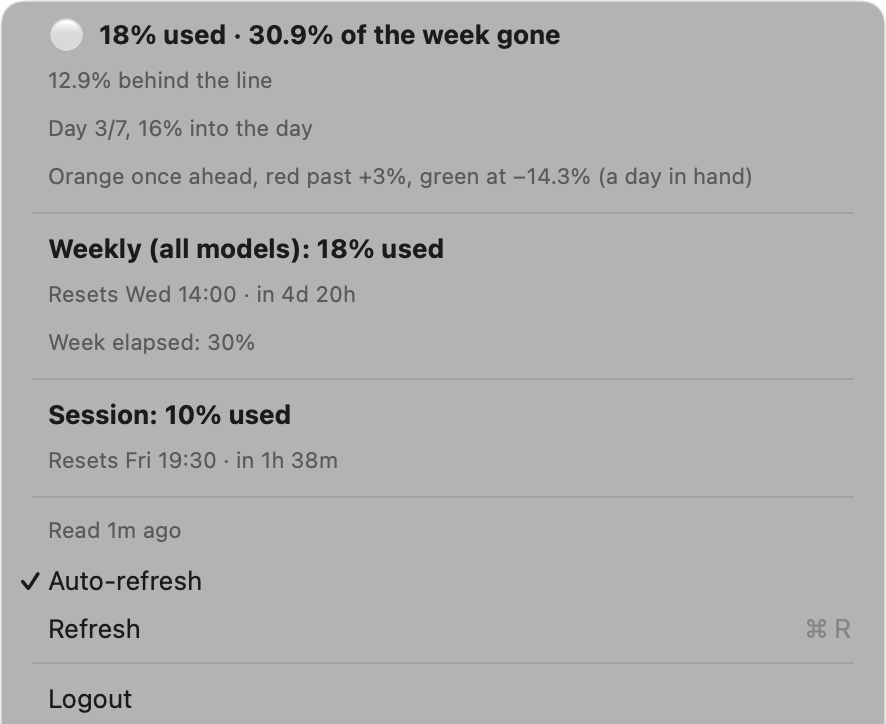

# Claude Usage

A macOS menu bar app that shows how much of your Claude plan you have used this
week — and whether you are on pace to make it last.




## What it shows

**In the menu bar:** `✦ 18%·31%`

- **18%** — the weekly limit used, all models. Turns orange at 90 % and red at 95 %.
- **31%** — how much of the week has gone by: where an even spread would put you
  right now. Coloured by how far you are from that line:
  - **green** — a full day's allowance (1/7 of the week) or more in hand
  - **orange** — ahead of the line
  - **red** — more than 3 points ahead of it
  - neutral — anywhere in between

**In the menu:** the pace in detail, the weekly and the session limit with their
reset times, and any per-model limit you have started using.

**Monthly spend:** `$… this month · $… total` across every coding agent
[ccusage](https://github.com/ccusage/ccusage) finds logs for, and a
**Monthly report…** window with a table per month that expands into the models
behind it. ccusage is read when you open the menu (at most every 30 minutes) and
once a day in the background. Each month is kept in
`~/Library/Application Support/ClaudeUsage/usage-history.json`, so it stays in
the report after Claude Code cleans up its old logs.

**Keep Mac awake (displays may sleep):** holds the Mac awake the way
`caffeinate -ims` does, while the displays still go to sleep. Remembered across
launches.

The figures stay in the menu bar while they are being refreshed and across
restarts. Once they are more than 15 minutes old they dim and the sparkle turns
into a warning triangle.

## Where the figures come from

1. **Claude Code** — `claude -p /usage` reports the plan limits straight from
   the server. It is a built-in command: no model call, no tokens used. It runs
   in a folder of its own, so macOS has no reason to ask for access to your
   Desktop or Documents.
2. **claude.ai** — if the CLI isn't there, the app reads the usage page in a
   hidden web view. It signs in with your Chrome session (macOS asks once for
   access to "Chrome Safe Storage" in the keychain) or through a login window.

The figures refresh every 5 minutes, and not while the Mac is asleep or you have
been away for more than 10 minutes.

## Requirements

- macOS 14 Sonoma or later
- [Claude Code](https://code.claude.com/docs) signed in — recommended; otherwise Chrome or the login window
- [Bun](https://bun.sh), for the monthly spend (optional — `bunx` fetches ccusage on first use)

## Installation

### Download

1. Download `ClaudeUsage-1.0.zip` from [Releases](https://github.com/ACiDekCZ/claude-usage/releases).
2. Unzip it and move **ClaudeUsage.app** to Applications.
3. The app is not notarized, so on the first launch macOS refuses to open it:
   open **System Settings → Privacy & Security** and click **Open Anyway**.
   Or clear the quarantine flag from the terminal:
   ```bash
   xattr -dr com.apple.quarantine /Applications/ClaudeUsage.app
   ```

To start it with your Mac, add it in **System Settings → General → Login Items**.

### Build from source

Needs Xcode 15 or later.

```bash
git clone https://github.com/ACiDekCZ/claude-usage.git
cd claude-usage
./build.sh
cp -R ClaudeUsage.app /Applications/
```

## clu — the same figures in the terminal

`cli/clu` is a small Python 3.9+ script around the same `claude -p /usage` call.

```bash
ln -s "$PWD/cli/clu" ~/.local/bin/clu
```

```
$ clu
18% used
31% of week gone
10% of session used · resets in 1h 38m

$ clu --full
Session   10%  ██··············  resets in 1h 40m  (Fri 2 Oct, 19:29)
Week      18%  ███·············  resets in 4d 20h  (Wed 7 Oct, 13:59)

Pace      18% used vs 30.8% of the week gone  12.8% behind the line
```

`--json` gives machine-readable output, `--raw` passes the CLI's output through
unchanged.

## Privacy

Everything stays on your Mac. The app runs local tools (`claude`, `bunx
ccusage`) and, only as the fallback, loads claude.ai. There is no telemetry and
nothing is sent anywhere else. A debug log is written to
`/tmp/claude-usage-debug.log` and cleared on every launch.

## License

Copyright © 2026 Milan Víšek.

This Source Code Form is subject to the terms of the Mozilla Public License,
v. 2.0. If a copy of the MPL was not distributed with this file, You can
obtain one at https://mozilla.org/MPL/2.0/. See [LICENSE](LICENSE).

## Disclaimer

This is an unofficial app. It is not affiliated with, endorsed by or supported
by Anthropic. Claude is a trademark of Anthropic, PBC.
